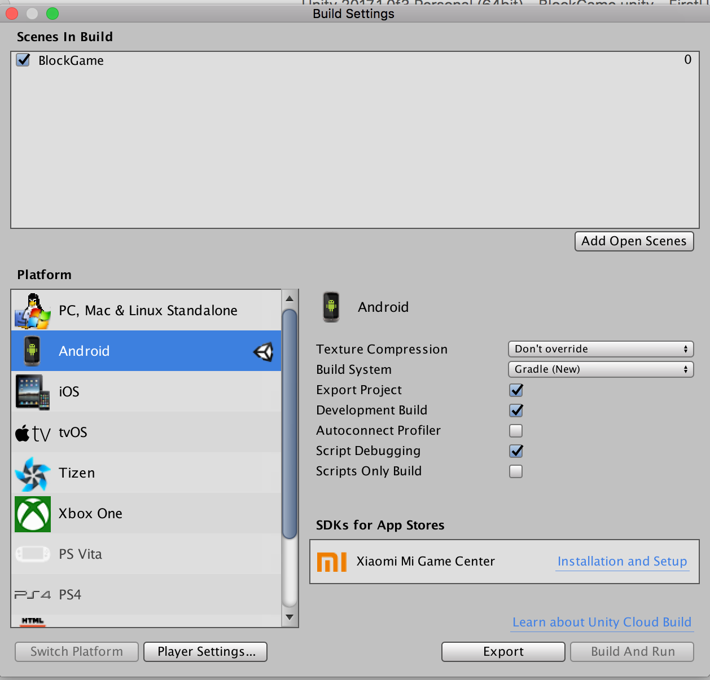

# Unity to Android

### <a style='color: light-blue'>1) Exportacion </a>

Para exportar de unity a android tenemos que configurar lo siguiente:

**Unity -> Preferences -> External Tools -> Android**

- SDK: `/Users/romanarranzguerrero/Library/Android/sdk`
- JDK: `/Library/Java/JavaVirtualMachines/jdk1.8.0_131.jdk/Contents/Home`

Una vez configurado el SDK de Android podemos exportar el proyecto

**File -> Build Settings...**




1. **Click Android + Switch Platform**
2. **Params:**
	- Texture Compression: dont override
	- Build System: Gradle (new)
	- Export Project
	- Development Build
	- Script Debugging

3. **Player Settings:**
	- Player Settings
		- Company Name: romanarranz
		- Product Name BlockGame
	- Settings for Android:
		- Resolution -> Scaling Disabled
		- Orientation -> Landscape left
		- Use 32-bit Display Buffer -> Enable
	- Rendering
		- Identification
			- Package name: com.github.romanarranz.blockgame
			- Version: 1.0
			- Bundle Version Code: 1
		- Configuration
			- Android Game: Enabled

### <a style='color: light-blue'>2) Abrir el Proyecto Unity con Android Studio</a>


**Import Project Eclipse / Gradle / etc...**

Ahora nos dirigimos al archivo build.gradle y ponemos que nuestra version de gradle es la 2.2.0 para que salga el dialogo del asistente de gradle y lo actualice todo automaticamente.

El gradle resultante tiene esta dependencia:

```
buildscript {
	repositories {
		jcenter()
	}

	dependencies {
		classpath 'com.android.tools.build:gradle:2.3.3'
	}
}
```

### <a style='color: light-blue'>3) Convertir el proyecto a Libreria</a>

Tras esto como vamos a embeber la aplicacion de Unity en otra Aplicacion Android tenemos que convertir el proyecto a Libreria, para ello:

**Modificar el Manifest.xml**

```xml
<activity 
android:label="@string/app_name" 
android:screenOrientation="landscape" 
android:launchMode="singleTask" 
android:configChanges="mcc|mnc|locale|touchscreen|keyboard|keyboardHidden|navigation|orientation|screenLayout|uiMode|screenSize|smallestScreenSize|fontScale|layoutDirection" 
android:name="com.github.romanarranz.blockgame.UnityPlayerActivity">
	<!--
	<intent-filter>
		<action android:name="android.intent.action.MAIN" />
		<category android:name="android.intent.category.LAUNCHER" />
	</intent-filter>
	-->
	<meta-data android:name="unityplayer.UnityActivity" android:value="true" />
</activity>
```

**Pasar a libreria con Gradle**

Eliminar el applicationId ya que esto no será mas una app

```
// apply plugin: 'com.android.application'
apply plugin: 'com.android.library'

android {
	...
	defaultConfig {
		targetSdkVersion 26
		// - Eliminar la sig linea -
		// applicationId 'com.github.romanarranz.blockgame'
	}
}
```

Construir el proyecto y copiar el archivo **AAR** fuera del proyecto, ya que esta sera nuestra libreria, para ello hacer Gradle Build y ya está.

### <a style='color: light-blue'>4.1) FUNCIONA - Añadir un proyecto Android como libreria</a>

- Crear una app nativa
- Añadir el nuevo modulo aar: **File -> New -> Import Module -> Seleccionar el proyecto**
- Asegurarse que en **settings.gradle** hay la siguiente linea:
	
	```
	include ':app', ':your_aar_file'
	```
- Añadir una dependencia en el main gradle de la app de el propio aar

	```
	dependencies {
		compile project(":your_aar_file_name")
		compile fileTree(dir: 'libs', include: ['*.jar'])
		...
	}
	```
	
- Sync Gradle

> https://stackoverflow.com/questions/16710290/how-to-delete-a-module-in-android-studio
> 
> En caso de que queramos eliminar el modulo y reemplazarlo por otro tendremos que ir a **File -> Project Structure -> Seleccionar Modulo y darle al boton - (arriba izq)**, luego eliminariamos su carpeta y ya está.

### <a style='color: darkred'>4.2) NO FUNCIONÓ - Añadir la libreria AAR a una aplicacion nativa de Android</a>


- Crear una app nativa
- Añadir el nuevo modulo aar: **File -> New -> New Module -> Import JAR/AAR Package**
- Asegurarse que en **settings.gradle** hay la siguiente linea:
	
	```
	include ':app', ':your_aar_file'
	```
- Añadir una dependencia en el main gradle de la app de el propio aar

	```
	dependencies {
		compile project(":your_aar_file_name")
		compile fileTree(dir: 'libs', include: ['*.jar'])
		...
	}
	```
	
- Sync Gradle

### <a style='color: light-blue'>5) Solucionar issue: gradle "Merger"</a>

Despues de sincronizar el gradle podemos obtener el error

> Manifest merger failed with multiple error, see logs

Esto es porque el merger esta intentando usar el icono y el tema de la libreria. Añadiremos codigo al manifest de la main app para indicarle al merger que usaremos el icono del manifest y el tema de la app actual, no la de otras librerias.

- Añadir al manifest el tag tools
- Añadir a app el reemplazamiento de iconos y temas

```xml
<?xml version="1.0" encoding="utf-8"?>
<manifest
    xmlns:android="http://schemas.android.com/apk/res/android"
    xmlns:tools="http://schemas.android.com/tools"
    package="com.github.romanarranz.blockgameapp">

    <application
        android:allowBackup="true"
        tools:replace="android:icon,android:theme"
        android:icon="@mipmap/ic_launcher"
        android:label="@string/app_name"
        android:roundIcon="@mipmap/ic_launcher_round"
        android:supportsRtl="true"
        android:theme="@style/AppTheme">
        <activity android:name=".MainActivity">
            <intent-filter>
                <action android:name="android.intent.action.MAIN" />

                <category android:name="android.intent.category.LAUNCHER" />
            </intent-filter>
        </activity>
    </application>

</manifest>
```

- Construir el proyecto de nuevo

### <a style='color: light-blue'>6) Llamar al Unity Player Activity</a>

Previamente añadimos al codigo de Unity el soporte para el button "BackPressed" de Android pero esto es un hack. Por lo que el script de C# llamará a **Application.Quit()** que cerrará al UnityPlayerActivity y tambien a la Activity del cual se ha llamado (liadon), por lo que para manejar esto crearemos una Activity Vacia que en el `onCreate()` llame al `UnityPlayerActivity` con un intent.

```java
import com.yourpackage.name.UnityPlayerActivity;
...
Intent intent = new Intent(mContext, UnityPlayerActivity.class);
startActivity(intent);
```

### <a style='color: #aaa'> 7) OPCIONAL: Comunicacion Android Framework - Unity</a>

- Mensaje desde **Unity -> Android**

	C# en Unity
	
	```csharp
	AndroidManager.GetInstance().CallJavaFunc( "javaTestFunc", "UnityJavaJarTest" );
	```
	
	Java en Android
	
	```java
	public void javaTestFunc(String strFromUnity) { 
		/* ... Do something here with java native api ... */ 
	} 
	```

- Mensaje desde **Unity <- Android**
	
	Java en Android
	
	```java
	// UnitySendMessage("SceneObjectName", "Method", "String Param");
	mUnityPlayer.UnitySendMessage("SceneObject", "ReceiveMsg", "HelloWorld"); 
	```
	
	C# en Unity
	
	```csharp
	public void ReceiveMsg(string msg) {
		Debug.Log(msg);
	}
```

## Referencias

- [gradle error org.gradle.api.internal.tasks.DefaultTaskInputs$](https://stackoverflow.com/questions/39034655/gradle-build-failing-after-update-to-3-0)
- [exporting and running unity3d in android](https://stackoverflow.com/questions/38980792/exporting-and-running-unity3d-project-to-android-studio)
- [communicating android with unity](https://github.com/inbgche/Unity-Android-Communication)
- [append unity view in android](https://medium.com/@ashoni/android-unity-integration-47756b9d53bd)
- [Medium: Embedded Unity within Android App as a library and not an App](https://medium.com/@davidbeloosesky/embedded-unity-within-android-app-7061f4f473a)
- [Medium: Android + Unity Integration](https://medium.com/@ashoni/android-unity-integration-47756b9d53bd)
- [Youtube: Touch Inputs Unity](https://www.youtube.com/watch?v=gKjKFZ30684)
- [Forum Unity3D: Deshabilitar modo Inmersivo de Unity en Android](https://forum.unity3d.com/threads/disable-immersivemode-unity5.313911/)
- [Export Java jar to Unity and Use it](https://xinyustudio.wordpress.com/2015/12/31/step-by-step-guide-for-developing-android-plugin-for-unity3d-i/)